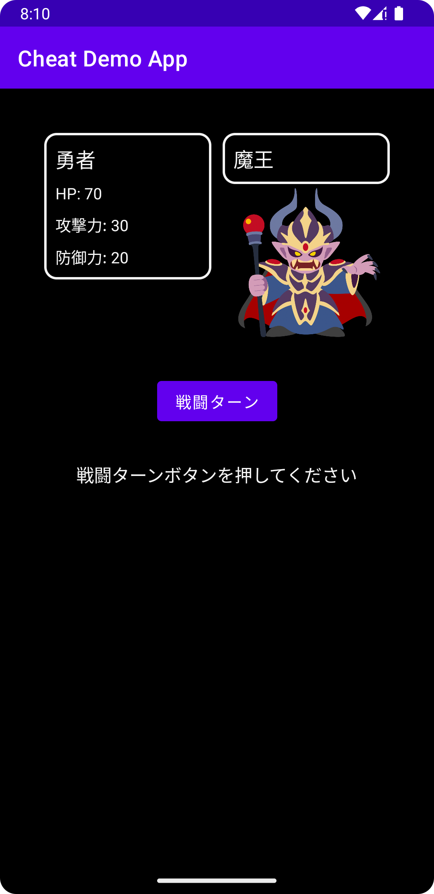

# チート対策勉強用やられデモアプリ

本アプリに対してチート攻撃を試み、チートが成立すること確認する。

## 構成

* MVVM アーキテクチャパターン  
  ViewModel + LiveData + ビューバインディング

* [Android 推奨のアーキテクチャ](https://developer.android.com/jetpack/guide?hl=ja) に準拠  
  UI Layer -> Repository Layer

## Dependencies

* ルーティング  
  [ナビゲーション](https://developer.android.com/guide/navigation/get-started)

* ローカルデータ保存  
  [SharedPreferences](https://developer.android.com/training/data-storage/shared-preferences?hl=ja)

* その他  
    * [バージョンカタログ](https://developer.android.com/studio/build/migrate-to-catalogs?hl=ja) 

## 画面のスクリーンショット

## デモ

https://github.com/seabat/cheat-demo-app/assets/4818667/7fe417bb-2464-4114-a350-10eb636ea836

